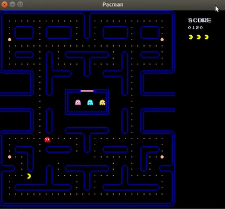

# Pacman
- Operational Systems course final project 2020.1. Development of the Pacman game using threads in a RTOS (OpenEPOS), using the C++ language
- Guilherme Araujo Machado do Nascimento and Lucas Barros Dallamico



## Game modes:
- Using Timer: 

In traits.h header file, set:

``` c++
static const bool active_timer = true;
```

- Using Dispatcher:

In traits.h header file, set:

``` c++
static const bool active_timer = false;
```